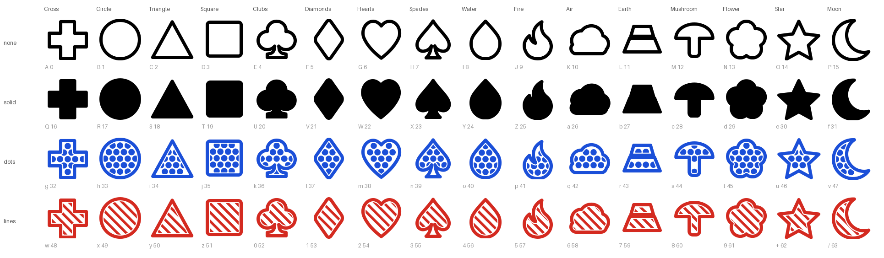

# Sixty Four

A font that renders base64 as 64 symbols a person can identify, describe out loud, and compare by eye.

`aGVsbG8gd29ybGQ=` is text nobody can read. You cannot diff two base64 strings at a glance, dictate one over a phone, or notice that a checksum changed. Sixty Four replaces each character of the base64 alphabet with a pictogram, and encodes each one **twice over — once as colour, once as hatch** — so the distinction survives a black-and-white printer, a photocopier, and colour blindness.



## The system

Every value decomposes cleanly:

```
value = tier × 16 + class × 4 + shape
```

| | 0 | 1 | 2 | 3 |
|---|---|---|---|---|
| **tier** (`value // 16`) | White / no fill | Black / total fill | Blue / dots | Red / lines |
| **class** (`value // 4 % 4`) | Shapes | Suits | Elements | Powers |
| **shape** (`value % 4`) | — | — | — | — |
| &nbsp;&nbsp;Shapes | Cross | Circle | Triangle | Square |
| &nbsp;&nbsp;Suits | Clubs | Diamonds | Hearts | Spades |
| &nbsp;&nbsp;Elements | Drop | Flame | Cloud | Ingot |
| &nbsp;&nbsp;Powers | Mushroom | Flower | Star | Moon |

So `A` = 0 is an empty cross, `Q` = 16 the solid cross, `g` = 32 the dotted cross, `w` = 48 the striped cross. Sixteen shapes, four tiers.

The four tiers form an ink ramp — empty, lines, dots, solid — chosen so they stay tellable apart with the colour thrown away. That ordering is asserted in the test suite for every one of the sixteen shapes.

## Using it

### On the web

`dist/sixty-four.css` has the font embedded inside it as a data URI. One file, no second request, nothing to upload:

```html
<link rel="stylesheet" href="sixty-four.css">

<span class="sixty-four">U2l4dHkgRm91cg==</span>
```

The stylesheet also switches to the font's dark palette under `prefers-color-scheme: dark`, so the blue and red lighten on a dark page instead of sitting at poor contrast. The empty and solid tiers use the text foreground colour, so they invert on their own.

### Anywhere else

Install `dist/SixtyFour-Regular.ttf` and select it as the font. Every glyph is exactly one em wide, so base64 stays in columns.

| File | What it is |
|---|---|
| `SixtyFour-Regular.ttf` | Colour font (COLR v0 + CPAL). Keeps full hatched outlines as fallback, so renderers without colour support show the artwork rather than nothing. |
| `SixtyFour-Regular.woff2` / `.woff` | The same font for the web. |
| `SixtyFourMono-Regular.ttf` / `.woff2` / `.otf` | No colour tables at all, for anywhere a colour table is unwelcome. |
| `sixty-four.css` / `sixty-four-mono.css` | Drop-in stylesheets with the font embedded. |
| `mapping.json` / `mapping.tsv` | The alphabet as data, for writing your own renderer. |
| `specimen.html` | Interactive specimen: live encoder, the full matrix, and a switch that drops the colour so you can check the hatch on its own. |

### What it covers

- The 64 base64 characters, `A`–`Z` `a`–`z` `0`–`9` `+` `/`
- `=` padding, drawn as a low hollow bar that shares no silhouette with any of the 64
- URL-safe base64 (RFC 4648 §5): `-` and `_` map onto the same symbols as `+` and `/`, so JWTs need no conversion
- Space and non-breaking space at the same one-em advance
- A visible `.notdef`, so anything that is *not* valid base64 shows up as an obvious slashed box

The font ships no substitution features, so two symbols can never fuse into one and the byte count stays countable.

## Hosting the specimen

`docs/` is a complete, self-contained site: the specimen page plus every file it offers for download. GitHub Pages serves it with no build step and no workflow.

**Settings → Pages → Source: *Deploy from a branch* → Branch: your default branch, folder `/docs`.**

The site lands at `https://<user>.github.io/<repo>/`. It is regenerated by `sixty-four-build`, so pushing a rebuild republishes it. `.nojekyll` is included — without it Pages runs the files through Jekyll, which drops any path beginning with an underscore.

## Building

```bash
uv sync --extra dev
uv run sixty-four-build      # writes svg/, dist/ and docs/
uv run pytest                # 43 checks, including the hatch ink ramp
```

Builds are reproducible &mdash; the font clock is pinned, so rebuilding without changing anything produces byte-identical files and the committed binaries do not churn.

Everything is generated from one source of truth. `Cyphenture entities - base64.tsv` is the authority for naming, and `src/sixtyfour/spec.py` asserts it agrees with the formula row for row.

| Module | Role |
|---|---|
| `spec.py` | The 64-entry table, checked against the TSV |
| `shapes.py` | The 16 silhouettes, optically normalised |
| `texture.py` | Stripe and dot grids, refined until they cover the space available |
| `geometry.py` | Path algebra over skia-pathops |
| `glyphs.py` | Silhouette × tier → finished geometry |
| `svgout.py` | The 66 SVGs |
| `ufobuild.py` / `fontbuild.py` | UFO assembly, then ufo2ft + COLR/CPAL |
| `web.py` | The embedded CSS, the specimen, and the `docs/` site |

Everything the font contains is a closed filled contour. There are no strokes, no `<pattern>`, and no `clipPath` anywhere — hatch is real geometry, clipped into the shape with boolean operations — so the SVGs survive any toolchain and the font needs no format that can carry more than outlines.

Six of the silhouettes &mdash; Circle, Clubs, Diamonds, Hearts, Drop and Flame &mdash; carry over the path data from the original hand-drawn set, normalised to a common optical weight. The other ten are authored in `shapes.py`.

## Licence

[SIL Open Font License 1.1](LICENSE).
